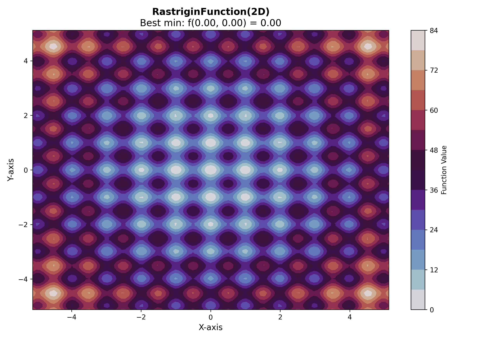
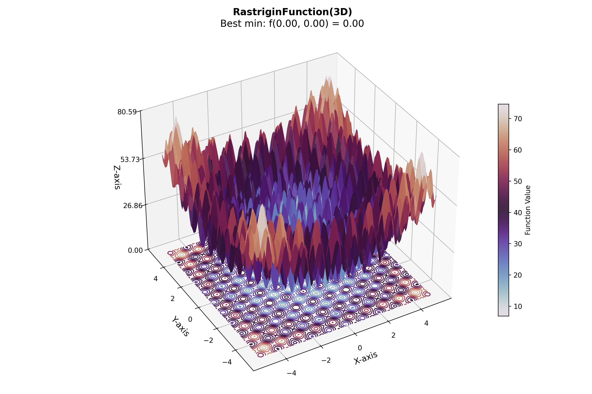
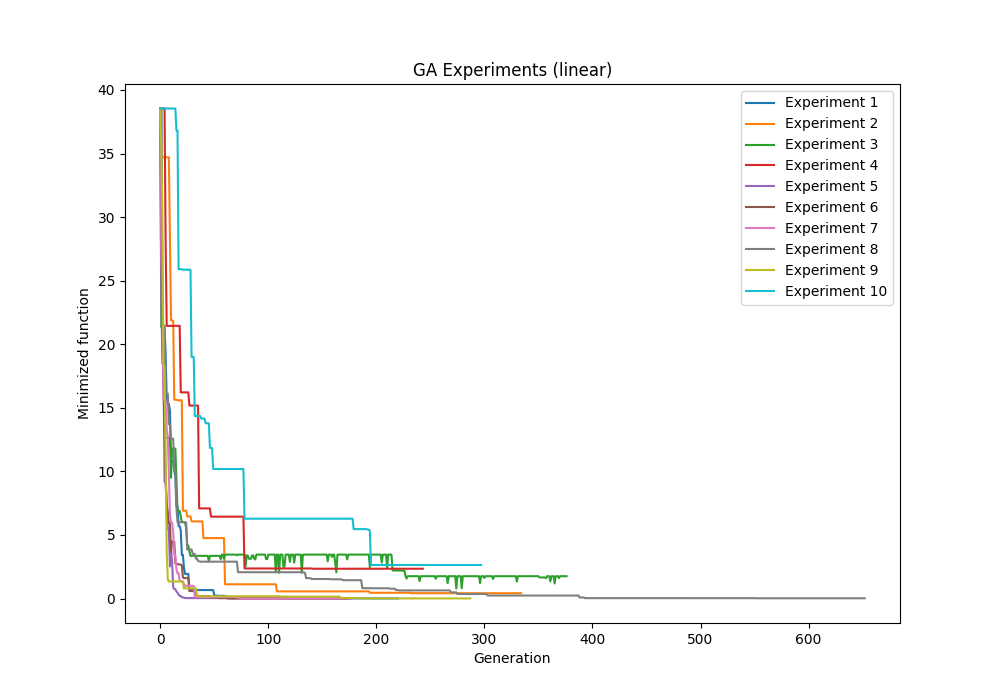
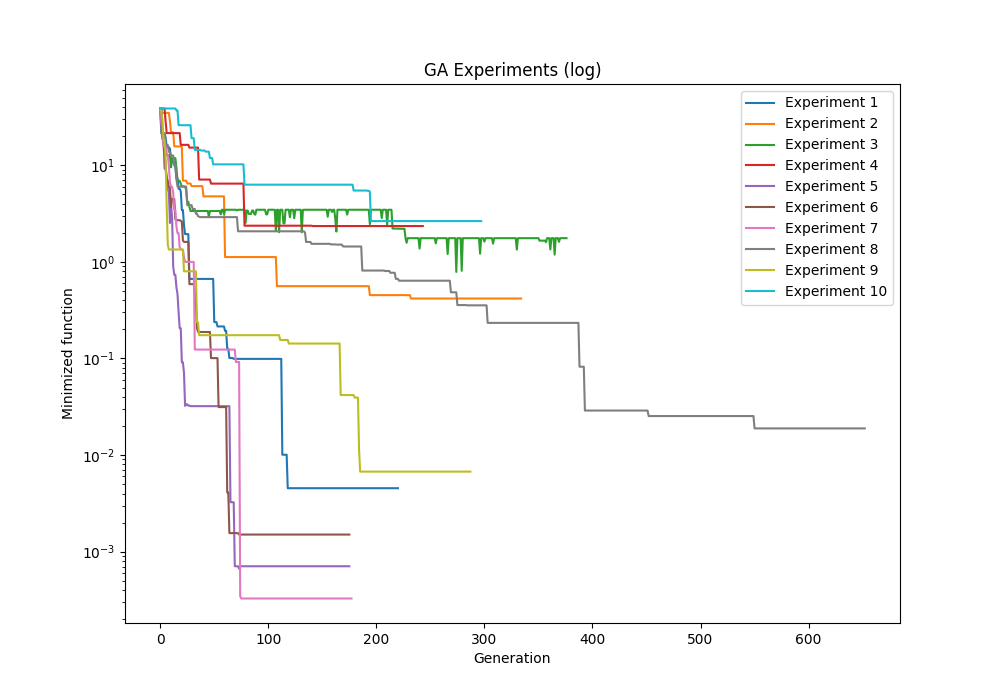
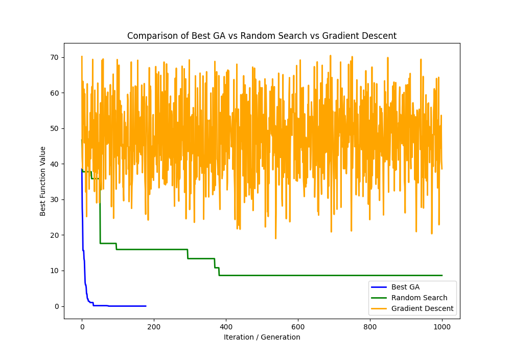
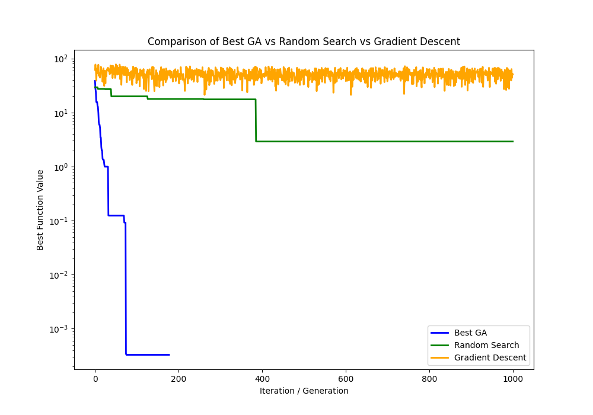

# Genetic Algorithm Optimization - Rastrigin Function

## Overview

This project implements a Genetic Algorithm (GA) to optimize the Rastrigin function, a non-convex multimodal function commonly used as a benchmark for optimization algorithms. The goal is to evaluate and test various GA parameters to minimize the function in the least number of generations.

## Objectives

- Test and evaluate the most important GA parameters to find the minimum value of the Rastrigin function efficiently.
- Analyze the impact of individual parameters on the convergence and performance of the algorithm.
- Provide tables summarizing the tested parameters and their results.
- Include graphical representations to justify findings.

## Features

- Python implementation using the `geneticalgorithm2` library.
- Automated generation of plots for convergence history and parameter comparisons.
- Support for multiple experiments with varying GA configurations.
- Comparison of GA results with Random Search and Gradient Descent methods.

## Results

- Tables summarizing parameter configurations and their corresponding results.
  - See the table in `output/ga_results.csv` for detailed experiment results.
- Graphs illustrating convergence trends and comparisons between optimization methods:

### Function Plots
#### 2D Plot


#### 3D Plot


### GA Convergence
#### Linear Scale


#### Logarithmic Scale


### Comparison Plots
#### Linear Scale


#### Logarithmic Scale


- Observations and comments on the impact of parameter changes.

## Usage

Run the pipeline using:
```bash
python genetical_algorithm.py
```

Generated outputs include:
- Function plots (2D and 3D).
- GA convergence plots (linear and logarithmic scales).
- Comparison plots between GA, Random Search, and Gradient Descent.
- Results saved in `output/ga_results.csv`.

## Reference

[1] https://github.com/PasaOpasen/geneticalgorithm2/tree/main

[2] https://github.com/PasaOpasen/OptimizationTestFunctions